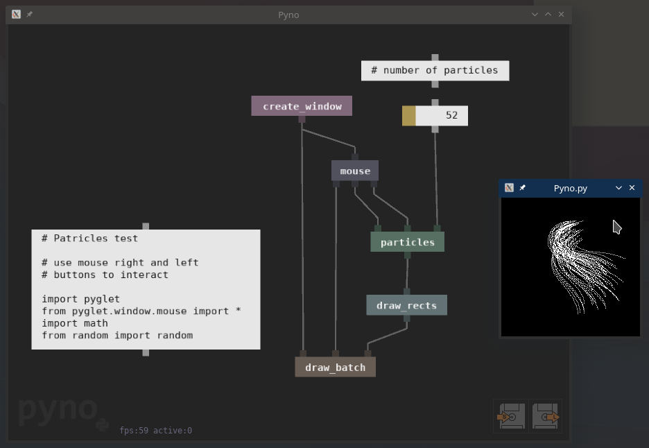
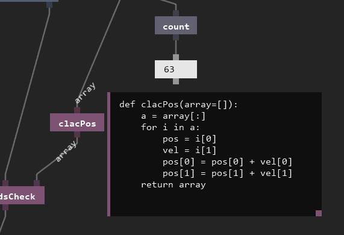

# Pyno — *Python-based data-flow visual programming*


**So, what you can?**
- real-time interactive development
- no predefined nodes - you will code yours 
- use python as you like (any libs and tips)
- crash-less errors
- perpetuum mobile (~60 fps bacchanalia)

*Pyno is an experiment. Real-world scenarios is confusing.*

# How to use

[Check wiki for advanced tutorials!](https://github.com/honix/Pyno/wiki)

**Basics:**

There are only three elements:

| Element | Description | Key on keyboard to spawn |
|-|-|:-:|
| **node** | is a function | **N** |
| **node from file** | exact same as node but loads from file | **O** |
| **field** | is a object, value or lambda function | **F** |
| **subpatch** | is a link to pyno-file, allows you to control complexity of your patches | **S** |

Controls:
- Use right-mouse-button to panning
- Save and load pyno-file using bottom-right buttons (S-save, L-load)
- Move and select elements by mouse, selected elements can be deleted by **Delete** key
- Selected elements can be **ctrl-c** and **ctrl-v**
- Nodes has a code inside, edit code just by pressing on node and hover code editor
- Last, you want to transfer data from element to element, just press and hold on pin and drop connection to other pin



# How to run
Make sure you have **Python 3.4** or better on your computer.

To install pyno you must run ```pip install .``` from this directory.
Pyno's dependencies `pyglet` and `pyperclip` are going to be installed automatically.
Then run ```pyno``` in a console.
